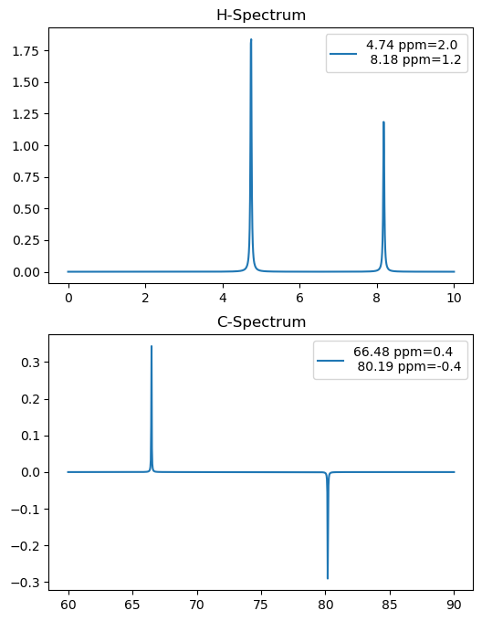
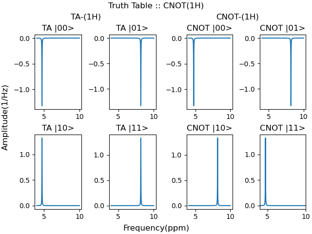
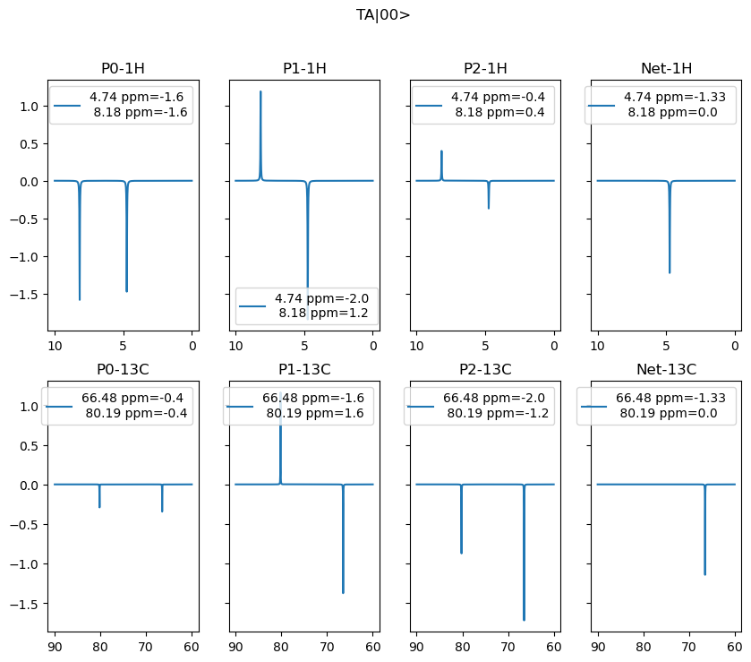

# Pulse-Sequence-Simulator
NMR Pulse Sequence Simulator

# Usage and Visualization
See the `examples` folder for more details. Here are some sample simulation results.

## CNOT gate

## Prepare $|00\rangle$ by Temporal Averaging

> **NOTE:** These simulations are designed to account for quirky `Spinsolve` software that likes to display frequency scale from high to low and while showing integrals it shows low freq integral first and then high frequency :blush: